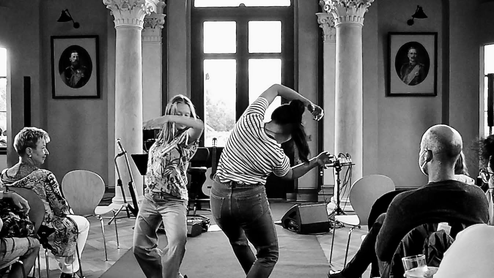
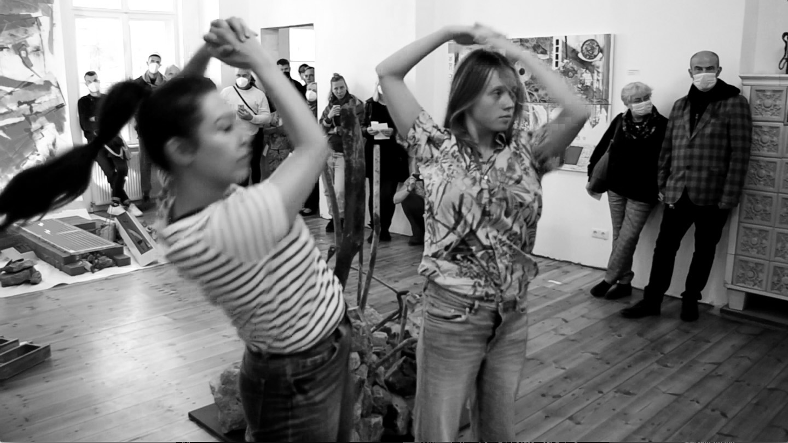

## Performance at Esperanto Bahnhof

In this performance, I collaborated with artist [Sasha Amaya](https://sashaamaya.com/) at *Esperanto Bahnhof* in Brandenburg, Germany. The production was organized and overseen by Falk Grever. The performance explored themes of space, movement, and communication in an unusual setting.

Here are some photos from the event:

You can find more details about the project on [Sasha Amaya's website](https://sashaamaya.com/2021/08/27/like-a-mirror-made-of-words-7-pm-fri-27-aug/).

---